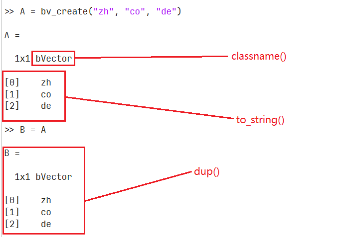

# Baltam Starter

一个简单的北太天元插件编写模板，以实现`bxArray*`类型的`vector`为例子。

插件通过gcc编译为动态库后，将被拷贝到北太天元的`plugins`插件目录下，插件编译时需要关闭软件。

## 插件编写
0. 描述插件信息`config.json`

   ```json
   {
      "name": "onePlugin",
      "version": "0.0.1",
      "Bversion": ">=2.0",
      "author": "zhcode",
      "description": "测试插件",
      "license": "",
      "icon": "",
      "release_date": "2024.04.12",
      "depends": []
   }
   ```

1. 编写函数声明`methods.hpp`

   ```C++
   extern const char* func_help;
   void func(int nlhs, bxArray *plhs[], int nrhs, const bxArray *prhs[]);
   ```

2. 实现声明的函数

   ```C++
   #include "methods.hpp"

   const char* func_help = R"(
      func 帮助字符串
   )";

   void func(int nlhs, bxArray *plhs[], int nrhs, const bxArray *prhs[])
   {
      bxPrintf("This is a func.\n");
   }
   ```

3. 导出函数列表

   ```C++
   static bexfun_info_t flist[] = {
      {"func", func, func_help}
   }
   ```

**自定义数据结构**



```C++
namespace baltam {
    /**
     * @class extern_obj_base
     * @brief 所有不属于 BALTAM 的外部对象基类。
     *
     * 当合作开发者/社区开发者使用 C++ 开发并且需要将某些对象临时托管到 BALTAM 中时，
     * 必须从这个类继承。
     *
     * 软件内核对该类对象仅定义抽象的方法，具体实现交给开发者。软件无需了解
     * @p extern_obj_base 子类的实现细节。
     */
    struct extern_obj_base {
        virtual extern_obj_base* dup() const { return nullptr; }
        virtual ~extern_obj_base() {};
        virtual std::string to_string() const { return ""; }
        virtual std::string classname() const { return "extern object"; };
        int sid; ///< 整数，用于存储内核自动分配的外部类 ID
    };
}
```

## 插件编译

1. 首先，确保你的系统已经安装了北太天元
2. 克隆项目到本地：
   ```bash
   git clone https://github.com/chillybird/Baltam_Starter.git
   ```
3. 修改`CMakeLists.txt`文件内容
   ```cmake
   # 项目/插件名称
   project(plugin_name)
   # ...
   # 北太天元插件安装位置
   set(BALTAM_PLUGIN_BASE_PATH "path/to/baltam/plugins")
   ```
4. 编译项目：
编译时关闭北太天元，否则不能将编译的插件复制到插件目录
   ```bash
   mkdir release
   cd release
   cmake -G "MinGW Makefiles" ..
   mingw32-make
   ```

## 目录结构

```
Baltam starter/
|   CMakeLists.txt
|   config.json    # 配置文件，供北太天元读取插件信息
|
|
+---baltam_sdk    # 北太天元插件开发SDK
|   |   baltamatica-sdk-manual.pdf
|   |
|   +---include
|   |   |   api_macro.h
|   |   |
|   |   +---ba_obj
|   |   |       extern_obj.h
|   |   |
|   |   \---bex
|   |           bex.h
|   |           bex.hpp
|   |           bex.import.hpp
|   |           bex_config.h
|   |           bx_op.h
|   |           extern_fcn_type.h
|   |
|   \---lib
|           bex.exe
|           libbaltam_core.dll
|           libba_worker.dll
|           libbex.dll
|           startCmd.bat
|
|
+---include
|       methods.hpp    # 功能函数头文件
|       pluginDataOps.hpp     # 重载内置运算符头文件
|       pluginDataTypes.hpp   # 自定义数据类型头文件
|
|
\---src
    |   main.cpp
    |   pluginDataOps.cpp     # 重载内置运算符实现
    |   pluginDataTypes.cpp   # 自定义数据类型实现
    |
    \---methods        # 功能函数实现
            bv_create.cpp
            bv_show.cpp
            bv_size.cpp
```

## 其他
[Windows下使用MSYS2开发和SDK教程](https://www.baltamatica.com/community/sposts/detail/f6a1e96d-fdaa-9e2d-084a-1ba23acef257.html)

